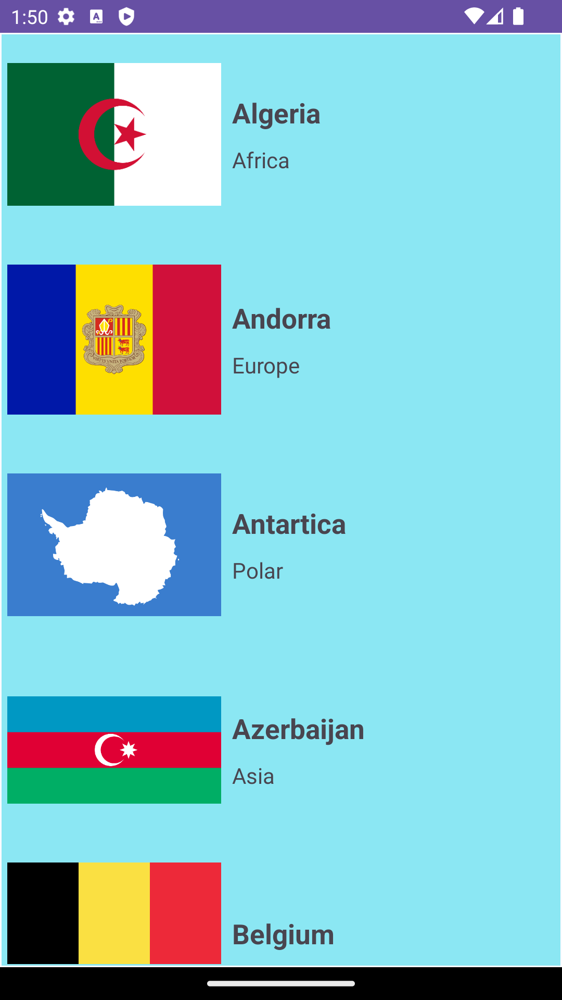
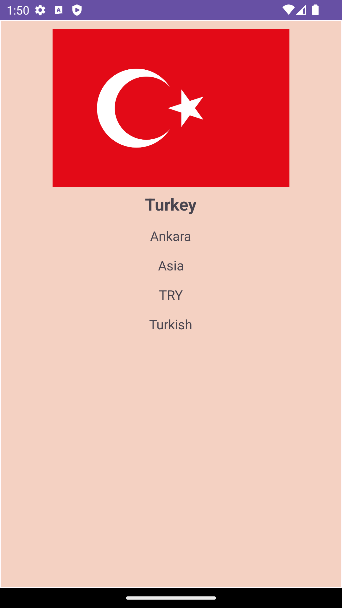

# CountryApp

CountryApp is an application that gives general information about countries.
We have collected general information such as the capital of the countries, 
what language they speak, and the currency in a single application.

# Libraries Used

+ MVVM Architecture
+ RxJava2
+ [Room](https://developer.android.com/training/data-storage/room)
+ [Navigation Component](https://developer.android.com/guide/navigation/navigation-getting-started)
+ [ViewModel](https://developer.android.com/topic/libraries/architecture/viewmodel#implement)
+ [Coroutines](https://developer.android.com/kotlin/coroutines)
+ [LiveData](https://developer.android.com/topic/libraries/architecture/livedata)
+ [Retrofit](https://square.github.io/retrofit/)
+ [Gson](https://github.com/google/gson)
+ [DataBinding](https://developer.android.com/jetpack/androidx/releases/databinding)

+ # Output
| Countries Screen | Country Detail Screen |
| --- | --- |
|  |  |
